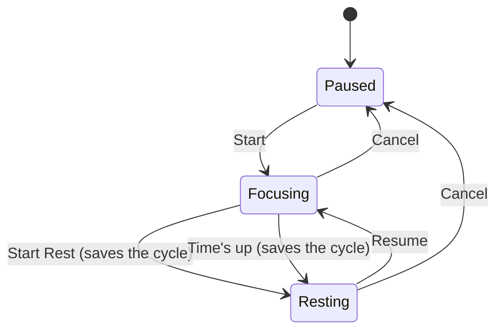
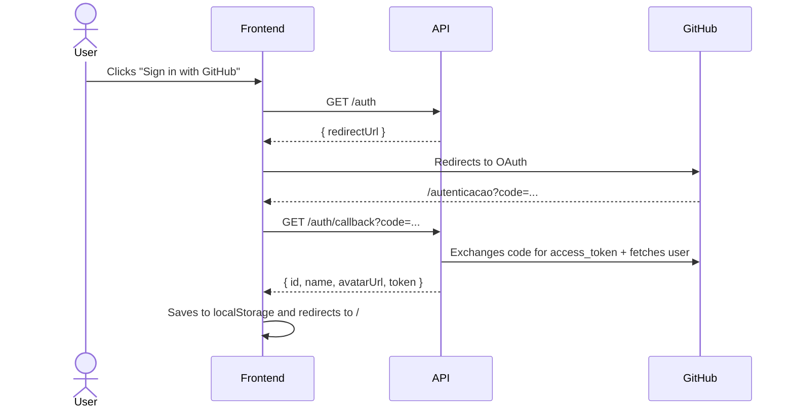

<div align="center">

# 🏆 Elite Tracker

**Build consistent habits and stay focused. A daily habit tracker with a Pomodoro timer and monthly statistics.**


[About](#-about) •
[Screens](#-screens) •
[Getting started](#-getting-started) •
[Structure](#-structure) •
[Sign-in flow](#-sign-in-flow) •
[Backend](#-backend)

</div>

---

## 📖 About

**Elite Tracker** is a web app for people who want to improve with consistency. With it you can:

- ✅ create **daily habits** and check off what you’ve done today;
- 📅 see on a **calendar** the days each habit was completed, along with the month’s completion rate;
- ⏱️ use a **focus and rest timer** (Pomodoro style) that records every cycle;
- 📊 view **statistics** on total cycles and total focus time per day.

All with **GitHub sign-in**, no account needed.

> 🇧🇷 The app’s interface is in Brazilian Portuguese.

## 🖼️ Screens

| Screen | Route | What’s in it |
|---|---|---|
| 🔑 **Sign in** | `/entrar` | "Sign in with GitHub" button |
| 🔄 **Authentication** | `/autenticacao` | Receives the GitHub `code` and completes sign-in |
| ✅ **Daily Habits** | `/` | Habit list, today’s checkbox, delete, calendar and metrics for the selected habit |
| ⏱️ **Focus Time** | `/foco` | Focus/rest setup (+5 min), timer, calendar and statistics |

> The `/` and `/foco` routes are **private**: without a signed-in user you are redirected to `/entrar`.

### ⏱️ How the timer works



Each completed focus cycle is sent to the API (`POST /focus-time`) and shows up marked on the calendar.

## 🚀 Getting started

### Prerequisites

- [Node.js](https://nodejs.org/) 18+
- The **[Elite Tracker API](https://github.com/agustinhopneto/dc-elitetracker-api)** running (by default at `http://localhost:4000`)

### Step by step

```bash
# 1. Clone the repository
git clone https://github.com/agustinhopneto/dc-elitetracker-front.git
cd dc-elitetracker-front

# 2. Install the dependencies
npm install

# 3. Set up the environment variables (.env file at the project root)

# 4. Run in development mode
npm run dev
```

Open **http://localhost:5173** 🎉

### Environment variables

| Variable | Description | Example |
|---|---|---|
| `VITE_API_URL` | API base URL | `http://localhost:4000` |
| `VITE_LOCALSTORAGE_KEY` | Prefix of the key used in `localStorage` | `elitetracker` |

### Scripts

| Command | Description |
|---|---|
| `npm run dev` | Development server (Vite) |
| `npm run build` | Type check + production build |
| `npm run preview` | Preview the production build |

## 🗂️ Structure

```
src/
├── components/        # Reusable components
│   ├── app-container/ #   Base layout
│   ├── button/        #   Button (info/error variants)
│   ├── header/        #   Header with title and date
│   ├── info/          #   Metric card
│   └── sidebar/       #   Avatar, navigation and sign-out
├── hooks/
│   └── use-user.tsx   # Auth context (sign-in/sign-out/localStorage)
├── routes/
│   ├── index.tsx      # Route definitions
│   └── private-route.tsx
├── screens/           # Screens: login, auth, habits, focus
├── services/
│   └── api.ts         # Axios with an interceptor that injects the Bearer token
├── styles/
│   └── global.css     # Color tokens and reset
├── app.tsx
└── main.tsx
```

## 🔐 Sign-in flow



## 🎨 Palette

| Token | Color |
|---|---|
| `--black-blue` |  `#04141C` |
| `--dark-blue` |  `#001E2B` |
| `--info` |  `#016BF8` |
| `--error` |  `#DB3030` |
| `--light` |  `#828282` |

Font: **[Lexend](https://fonts.google.com/specimen/Lexend)**

## 🔗 Backend

The API that powers this app lives at
👉 **[dc-elitetracker-api](https://github.com/agustinhopneto/dc-elitetracker-api)**

## 🛠️ Tech stack

- **[React 18](https://react.dev/)** + **[Vite](https://vitejs.dev/)**
- **[Mantine](https://mantine.dev/)** (`@mantine/core` and `@mantine/dates`): calendar and indicators
- **[React Router](https://reactrouter.com/)**: public and private routes
- **[react-timer-hook](https://github.com/amrlabib/react-timer-hook)**: focus/rest timer
- **[Phosphor Icons](https://phosphoricons.com/)**: icons
- **[Axios](https://axios-http.com/)** + **[Day.js](https://day.js.org/)** + **[clsx](https://github.com/lukeed/clsx)**
- **CSS Modules** + **PostCSS**
- **ESLint + Prettier**

---

<div align="center">

Made with 💙 by **[Agustinho Neto](https://github.com/agustinhopneto)**

</div>
