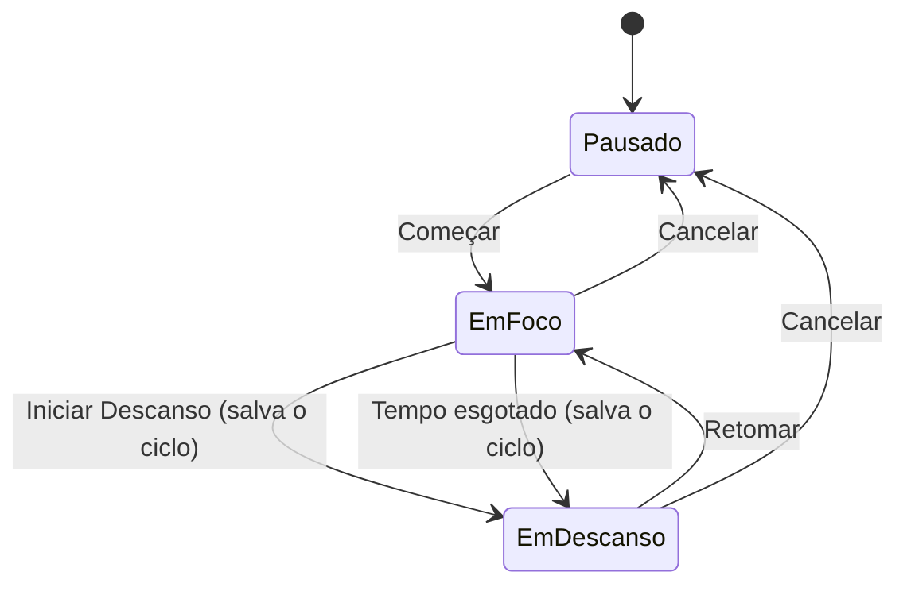
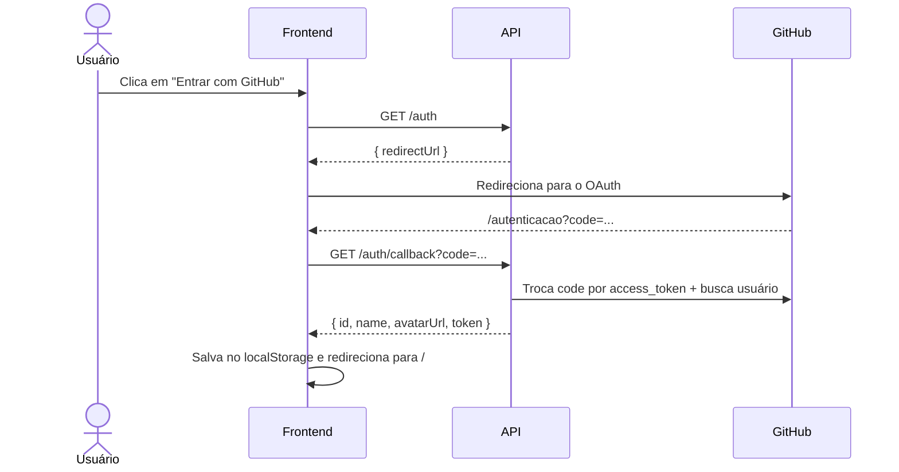

<div align="center">

# 🏆 Elite Tracker

**Construa hábitos consistentes e mantenha o foco. Um tracker de hábitos diários com timer Pomodoro e estatísticas mensais.**


[Sobre](#-sobre) •
[Telas](#-telas) •
[Como rodar](#-como-rodar) •
[Estrutura](#-estrutura) •
[Fluxo de login](#-fluxo-de-login) •
[Backend](#-backend)

</div>

---

## 📖 Sobre

O **Elite Tracker** é uma aplicação web para quem quer evoluir com constância. Com ele você:

- ✅ cadastra **hábitos diários** e marca o que já cumpriu hoje;
- 📅 acompanha no **calendário** os dias em que cada hábito foi concluído, com a porcentagem do mês;
- ⏱️ usa um **timer de foco e descanso** (estilo Pomodoro) que registra cada ciclo;
- 📊 vê **estatísticas** de ciclos totais e tempo total de foco por dia.

Tudo isso com **login via GitHub**, sem precisar criar conta.

## 🖼️ Telas

| Tela | Rota | O que tem |
|---|---|---|
| 🔑 **Login** | `/entrar` | Botão "Entrar com GitHub" |
| 🔄 **Autenticação** | `/autenticacao` | Recebe o `code` do GitHub e finaliza o login |
| ✅ **Hábitos Diários** | `/` | Lista de hábitos, checkbox do dia, exclusão, calendário e métricas do hábito selecionado |
| ⏱️ **Tempo de Foco** | `/foco` | Configuração de foco/descanso (+5 min), timer, calendário e estatísticas |

> As rotas `/` e `/foco` são **privadas**: sem usuário logado, você é redirecionado para `/entrar`.

### ⏱️ Como funciona o timer



Cada ciclo de foco concluído é enviado para a API (`POST /focus-time`) e aparece marcado no calendário.

## 🚀 Como rodar

### Pré-requisitos

- [Node.js](https://nodejs.org/) 18+
- A **[Elite Tracker API](https://github.com/agustinhopneto/dc-elitetracker-api)** rodando (por padrão em `http://localhost:4000`)

### Passo a passo

```bash
# 1. Clone o repositório
git clone https://github.com/agustinhopneto/dc-elitetracker-front.git
cd dc-elitetracker-front

# 2. Instale as dependências
npm install

# 3. Configure as variáveis de ambiente (arquivo .env na raiz)

# 4. Rode em modo desenvolvimento
npm run dev
```

Acesse **http://localhost:5173** 🎉

### Variáveis de ambiente

| Variável | Descrição | Exemplo |
|---|---|---|
| `VITE_API_URL` | URL base da API | `http://localhost:4000` |
| `VITE_LOCALSTORAGE_KEY` | Prefixo da chave usada no `localStorage` | `elitetracker` |

### Scripts

| Comando | Descrição |
|---|---|
| `npm run dev` | Servidor de desenvolvimento (Vite) |
| `npm run build` | Checagem de tipos + build de produção |
| `npm run preview` | Pré-visualiza o build de produção |

## 🗂️ Estrutura

```
src/
├── components/        # Componentes reutilizáveis
│   ├── app-container/ #   Layout base
│   ├── button/        #   Botão (variantes info/error)
│   ├── header/        #   Cabeçalho com título e data
│   ├── info/          #   Cartão de métrica
│   └── sidebar/       #   Avatar, navegação e logout
├── hooks/
│   └── use-user.tsx   # Contexto de autenticação (login/logout/localStorage)
├── routes/
│   ├── index.tsx      # Definição das rotas
│   └── private-route.tsx
├── screens/           # Telas: login, auth, habits, focus
├── services/
│   └── api.ts         # Axios com interceptor que injeta o Bearer token
├── styles/
│   └── global.css     # Tokens de cor e reset
├── app.tsx
└── main.tsx
```

## 🔐 Fluxo de login



## 🎨 Paleta

| Token | Cor |
|---|---|
| `--black-blue` |  `#04141C` |
| `--dark-blue` |  `#001E2B` |
| `--info` |  `#016BF8` |
| `--error` |  `#DB3030` |
| `--light` |  `#828282` |

Fonte: **[Lexend](https://fonts.google.com/specimen/Lexend)**

## 🔗 Backend

A API que alimenta esta aplicação está em
👉 **[dc-elitetracker-api](https://github.com/agustinhopneto/dc-elitetracker-api)**

## 🛠️ Tecnologias

- **[React 18](https://react.dev/)** + **[Vite](https://vitejs.dev/)**
- **[Mantine](https://mantine.dev/)** (`@mantine/core` e `@mantine/dates`): calendário e indicadores
- **[React Router](https://reactrouter.com/)**: rotas públicas e privadas
- **[react-timer-hook](https://github.com/amrlabib/react-timer-hook)**: timer de foco/descanso
- **[Phosphor Icons](https://phosphoricons.com/)**: ícones
- **[Axios](https://axios-http.com/)** + **[Day.js](https://day.js.org/)** + **[clsx](https://github.com/lukeed/clsx)**
- **CSS Modules** + **PostCSS**
- **ESLint + Prettier**

---

<div align="center">

Feito com 💙 por **[Agustinho Neto](https://github.com/agustinhopneto)**

</div>
